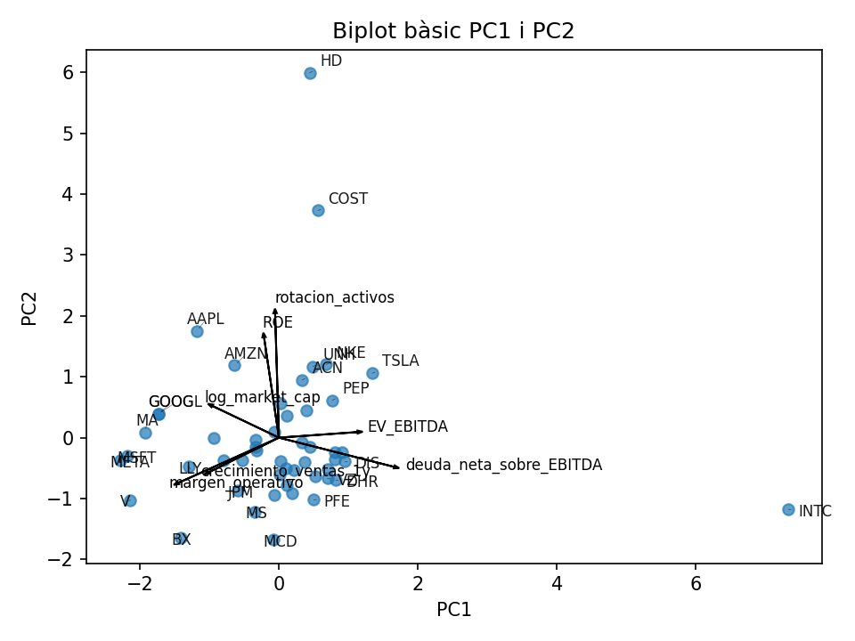
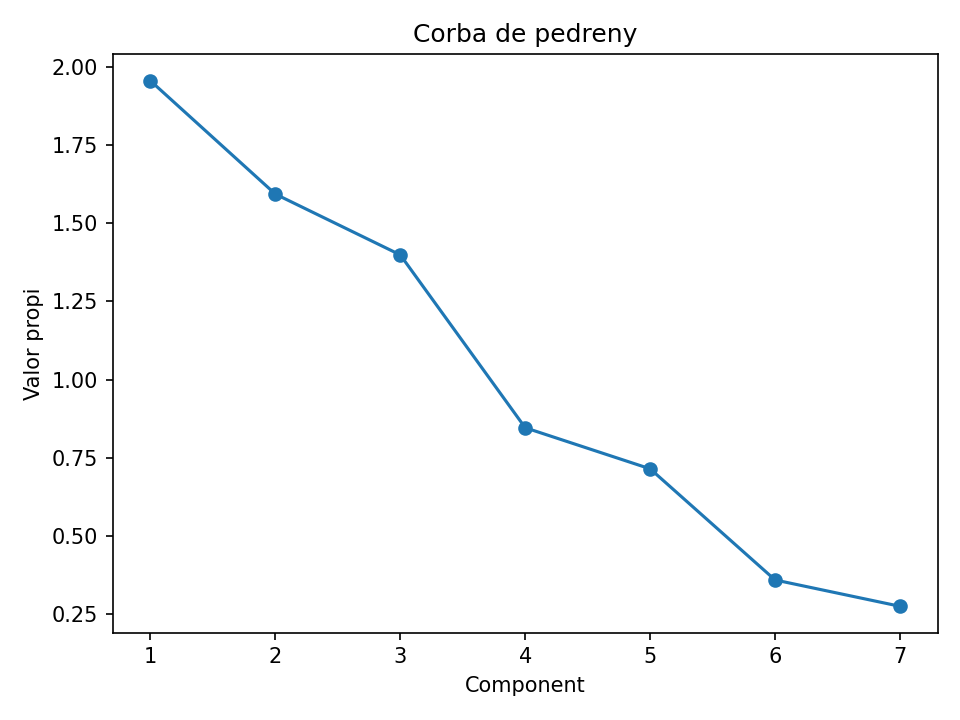
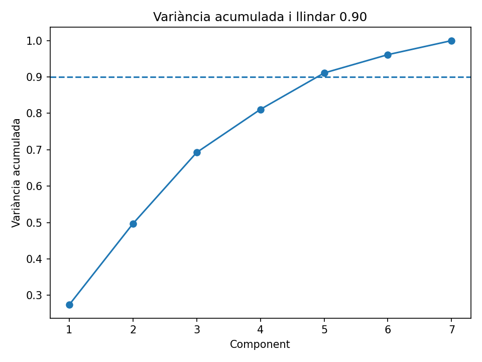

# Principal Component Analysis in Corporate Finance 📈

*Bachelor's Thesis in Mathematics – Universitat Autònoma de Barcelona (UAB)*

## Overview
This repository contains the Python implementation of my Final Degree Project, which explores the application of Principal Component Analysis (PCA) to high-dimensional financial data. 

The objective is to reduce the dimensionality of corporate fundamentals (analyzing the 50 largest S&P 500 companies by market capitalization in 2024) and extract underlying economic structures, identifying latent trade-offs between corporate scale, operational efficiency, and relative leverage.

## Methodology & Features
The core script (`ACP.py`) provides an end-to-end analytical pipeline designed for robustness and reproducibility:
* **Robust Preprocessing:** Handles missing data via median imputation and applies configurable bilateral winsorization to control the statistical leverage of extreme outliers (particularly crucial for EBITDA-based multiples).
* **Standardization:** Centers and scales variables to zero mean and unit variance prior to spectral decomposition.
* **PCA Execution:** Computes eigenvalues, explained variance ratios, and feature loadings using `scikit-learn`.
* **Dynamic Component Selection:** Automatically determines the optimal number of principal components to retain based on a user-defined cumulative variance threshold.
* **Automated Reporting:** Generates comprehensive CSV tables (scores, loadings, eigenvalues) and high-quality geometric visualizations.

## Key Visualizations

### 1. PCA Biplot (PC1 vs PC2)
The biplot provides a geometric interpretation of the market. Based on the factor loadings, **PC1** often captures the trade-off between corporate scale/margin and relative leverage/valuation, while **PC2** isolates asset efficiency and return on equity (ROE).


### 2. Scree Plot & Cumulative Variance
Visual diagnostics used to evaluate the spectral gap, the marginal contribution of each eigenvalue, and determine the optimal number of dimensions to retain.

<p align="center">
  
  
</p>

## Usage
The script is designed as a fully parametrized Command Line Interface (CLI) tool. 

> **Note:** The raw financial dataset is not included in this repository. To run the script, you must provide your own CSV file containing the required financial ratios (e.g., `log_market_cap`, `ROE`, `margen_operativo`, `rotacion_activos`, `deuda_neta_sobre_EBITDA`, `EV_EBITDA`, `crecimiento_ventas_1y`).

### Requirements
```bash
pip install numpy pandas matplotlib scikit-learn
```

### Execution
Run the script via terminal, pointing to your local CSV file:
```bash
python ACP.py --csv your_data.csv --umbral 0.90 --winsor 0.01 --outdir outputs
```

### Available Arguments
* `--csv` : Path to the input dataset (Required).
* `--umbral` : Cumulative variance threshold to select components (Default: `0.9`).
* `--winsor` : Bilateral winsorization limit (e.g., `0.01` for 1%). Set to `0` to disable.
* `--max_na_frac` : Maximum allowed fraction of NaNs per variable (Default: `0.2`).
* `--outdir` : Directory to save generated tables and plots (Default: `outputs`).
* `--label_col` : Column name used for plotting labels in the biplot (Default: `ticker`).

## License
This project is licensed under the MIT License.
